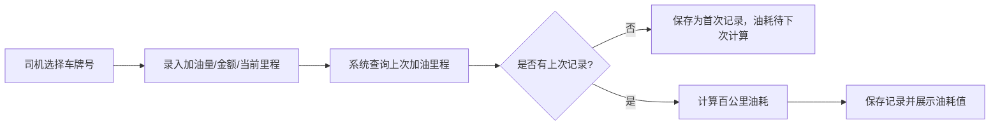
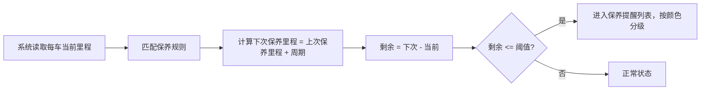

## 1. 产品概述

面向 5-10 辆规模的小型物流车队，提供油耗与维修一体化管理工具。解决车队油耗数据分散、维修记录混乱、成本难以量化、保养周期遗忘等核心痛点。

- 核心价值：通过数据可视化与自动化提醒，帮助车队管理者降本增效，延长车辆使用寿命
- 目标用户：车队管理者（决策层）、司机（执行层）

---

## 2. 核心功能

### 2.1 用户角色

| 角色 | 核心权限 |
|------|----------|
| 车队管理者 | 全部功能：车辆档案、报表查看、排名分析、保养提醒配置 |
| 司机 | 录入加油记录、提交维修申请、查看本人车辆历史 |

### 2.2 功能模块

1. **仪表盘总览**：核心指标卡片、当月总油耗/维修费用趋势、保养提醒告警
2. **车辆档案管理**：车辆列表、新增/编辑车辆、档案详情
3. **加油管理**：加油记录录入、百公里油耗自动计算、历史查询
4. **维修管理**：维修申请提交、维修记录登记、维修历史查看
5. **单车详情**：油耗趋势折线图、维修历史时间线、完整档案信息
6. **报表中心**：当月油耗排名、维修费用排名、月度总成本汇总
7. **保养提醒**：提醒规则设置、到期车辆列表、推送通知

### 2.3 页面详情

| 页面名称 | 模块名称 | 功能描述 |
|----------|----------|----------|
| 仪表盘 | KPI 卡片 | 展示车辆总数、当月总油耗(L)、当月总维修费(¥)、待保养车辆数 |
| 仪表盘 | 趋势图表 | 近6个月油耗与维修费用双轴柱状+折线图 |
| 仪表盘 | 保养提醒区 | 展示即将到达保养里程的车辆及剩余公里数，带警示色 |
| 车辆档案 | 车辆列表 | 卡片式展示车牌号、车型、当前里程、所属司机，支持搜索过滤 |
| 车辆档案 | 新增/编辑表单 | 车牌号、车型、初始里程、所属司机、购车日期字段录入 |
| 加油管理 | 加油录入表单 | 车牌号选择、加油量(L)、金额(¥)、当前里程、加油站、日期 |
| 加油管理 | 油耗自动计算 | 与上次加油记录对比，自动计算百公里油耗并展示 |
| 加油管理 | 加油历史列表 | 按时间倒序展示所有加油记录，支持按车牌筛选 |
| 维修管理 | 维修申请单 | 车牌号、故障描述、维修厂名称、维修类型（常规/故障/保养） |
| 维修管理 | 维修完成登记 | 补充维修日期、总费用、维修后里程数 |
| 维修管理 | 维修历史列表 | 卡片展示所有维修记录，支持按类型/车牌筛选 |
| 单车详情 | 油耗趋势图 | 以加油时间为 X 轴，百公里油耗为 Y 轴的折线图，标注均值线 |
| 单车详情 | 维修时间线 | 垂直时间线展示每次维修，标注类型、费用、里程 |
| 单车详情 | 车辆信息卡 | 完整档案信息 + 累计油耗、累计维修费汇总 |
| 报表中心 | 油耗排名 | 柱状图展示当月各车油耗(L/百公里)从低到高排名 |
| 报表中心 | 维修费用排名 | 横向条形图展示当月各车维修费用排名 |
| 报表中心 | 成本汇总 | 当月油耗总成本、维修总成本、合计总成本，支持按月切换 |
| 保养提醒 | 规则设置 | 设置每 N 公里提醒一次（默认 5000），允许单独覆盖 |
| 保养提醒 | 待保养列表 | 按「剩余里程」升序排列，< 500km 标红，< 1000km 标黄 |

---

## 3. 核心流程

### 3.1 加油与油耗计算流程

司机每次加油时，系统自动拉取该车上一次加油的里程数，用「(当前里程 - 上次里程) / 本次加油量 × 100」得出百公里油耗，并写入记录。

### 3.2 维修申请与完成流程

### 3.3 保养提醒触发流程

---

## 4. 用户界面设计

### 4.1 设计风格

- **主色调**：深空蓝 `#0F2540`（专业、信赖）+ 工业橙 `#FF6B35`（警示、行动点）
- **辅助色**：油耗绿 `#2ECC71`、维修费紫 `#9B59B6`、警报红 `#E74C3C`、提醒黄 `#F1C40F`
- **背景**：主背景 `#F5F7FA`，卡片白 `#FFFFFF`，侧边栏深 `#0A1929`
- **按钮风格**：圆角 8px，实心主按钮（工业橙）+ 描边次级按钮，带微悬停抬升动画
- **字体**：标题用「思源黑体 Bold」，正文用「思源黑体 Regular」，数字用「JetBrains Mono」等宽字体
- **布局风格**：左侧固定导航栏（深色调）+ 顶部面包屑 + 主体卡片网格布局
- **图标风格**：线性图标（Lucide 风格），与物流/车辆主题匹配（卡车、油桶、扳手、仪表盘）

### 4.2 页面设计概览

| 页面名称 | 模块名称 | UI 元素 |
|----------|----------|---------|
| 仪表盘 | KPI 卡片 | 深色渐变背景 + 大号数字 + 同比箭头 + 微型趋势图 |
| 仪表盘 | 趋势图表 | 双轴混合图（柱状油耗 + 折线维修）+ 图例悬浮高亮 |
| 仪表盘 | 保养提醒 | 卡片列表，卡片左侧进度条渐变（绿→黄→红）表示剩余里程 |
| 车辆档案 | 车辆卡片 | 车型 emoji 头图 + 车牌大号展示 + 里程环 + 司机头像 |
| 加油管理 | 录入表单 | 双列布局，左侧表单右侧实时油耗预览卡 |
| 维修管理 | 时间线卡片 | 垂直时间线，维修类型用彩色徽章区分 |
| 单车详情 | 油耗趋势图 | 平滑曲线折线图，均值参考虚线 + 异常点红点标注 |
| 报表中心 | 排名图表 | 渐变柱形，第一名带奖牌图标，支持悬浮查看详情 |
| 保养提醒 | 待保养列表 | 表格布局，剩余里程列背景色分级 |

### 4.3 响应式设计

- Desktop-first（1280px+）：侧边栏 260px 固定，主体区 3-4 列网格
- Tablet（768-1280px）：侧边栏 64px 折叠（仅图标），主体区 2 列网格
- Mobile（<768px）：顶部汉堡菜单，卡片单列，图表自适应宽度，触摸按钮最小 44px

---
