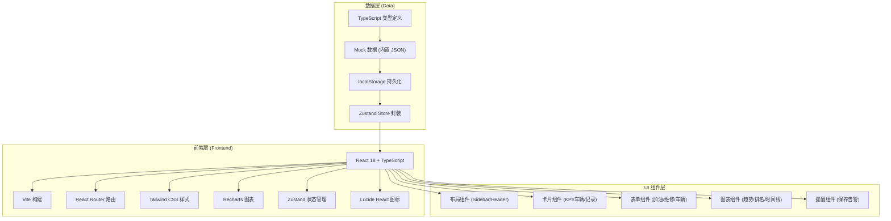
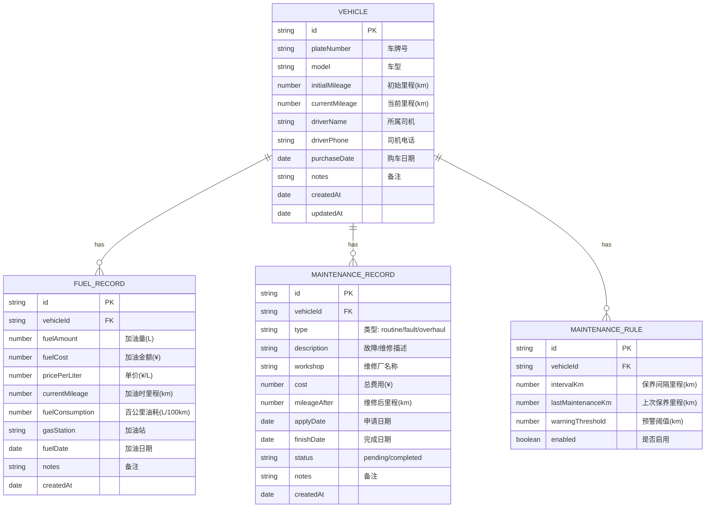

## 1. 架构设计



---

## 2. 技术选型

| 类别 | 技术方案 | 版本 | 说明 |
|------|----------|------|------|
| 前端框架 | React | 18.x | 函数式组件 + Hooks |
| 语言 | TypeScript | 5.x | 严格类型检查 |
| 构建工具 | Vite | 5.x | 极速开发体验 |
| 样式 | Tailwind CSS | 3.x | 原子化 CSS |
| 路由 | React Router DOM | 6.x | 声明式路由 |
| 状态管理 | Zustand | 4.x | 轻量、简单的 Store |
| 图表 | Recharts | 2.x | 基于 React 的图表库（折线/柱状/混合） |
| 图标 | Lucide React | 0.400.x | 简洁线性图标 |
| 后端 | 无 | - | 纯前端应用，localStorage + Mock 数据 |
| 持久化 | localStorage | - | 浏览器本地存储 |

---

## 3. 路由定义

| 路由路径 | 页面组件 | 说明 |
|----------|----------|------|
| `/` | Dashboard | 仪表盘总览（默认首页） |
| `/vehicles` | VehicleList | 车辆档案列表 |
| `/vehicles/new` | VehicleForm | 新增车辆 |
| `/vehicles/:id` | VehicleDetail | 单车详情（油耗趋势+维修时间线） |
| `/fuel` | FuelList | 加油记录管理 |
| `/fuel/new` | FuelForm | 新增加油记录 |
| `/maintenance` | MaintenanceList | 维修记录管理 |
| `/maintenance/new` | MaintenanceForm | 新增维修申请/记录 |
| `/reports` | Reports | 报表中心（排名+汇总） |
| `/reminders` | Reminders | 保养提醒管理 |

---

## 4. 数据模型

### 4.1 ER 图



### 4.2 核心计算逻辑

```typescript
// 百公里油耗计算
function calcFuelConsumption(
  currentMileage: number,
  lastMileage: number,
  fuelAmount: number
): number | null {
  if (!lastMileage || currentMileage <= lastMileage) return null;
  const distance = currentMileage - lastMileage;
  if (distance <= 0 || fuelAmount <= 0) return null;
  return +((fuelAmount / distance) * 100).toFixed(2);
}

// 保养剩余里程
function calcRemainingKm(
  currentMileage: number,
  lastMaintenanceKm: number,
  intervalKm: number
): { remaining: number; nextKm: number; level: "safe" | "warning" | "danger" } {
  const nextKm = lastMaintenanceKm + intervalKm;
  const remaining = nextKm - currentMileage;
  let level: "safe" | "warning" | "danger" = "safe";
  if (remaining <= 500) level = "danger";
  else if (remaining <= 1000) level = "warning";
  return { remaining, nextKm, level };
}
```

---

## 5. Store 设计（Zustand）

```typescript
interface AppState {
  // 数据
  vehicles: Vehicle[];
  fuelRecords: FuelRecord[];
  maintenanceRecords: MaintenanceRecord[];
  maintenanceRules: MaintenanceRule[];

  // 当前筛选状态
  filters: {
    month: string; // YYYY-MM
    vehicleId: string | null;
  };

  // Actions - 车辆
  addVehicle: (v: Omit<Vehicle, "id" | "createdAt" | "updatedAt">) => void;
  updateVehicle: (id: string, patch: Partial<Vehicle>) => void;
  deleteVehicle: (id: string) => void;
  getVehicleById: (id: string) => Vehicle | undefined;

  // Actions - 加油
  addFuelRecord: (r: Omit<FuelRecord, "id" | "createdAt" | "fuelConsumption">) => void;
  getFuelRecordsByVehicle: (vehicleId: string) => FuelRecord[];

  // Actions - 维修
  addMaintenanceRecord: (r: Omit<MaintenanceRecord, "id" | "createdAt">) => void;
  completeMaintenance: (id: string, finish: { finishDate: string; cost: number; mileageAfter: number }) => void;
  getMaintenanceRecordsByVehicle: (vehicleId: string) => MaintenanceRecord[];

  // Actions - 报表计算
  getMonthlyFuelRank: (month: string) => Array<{ plate: string; avgConsumption: number; totalFuel: number }>;
  getMonthlyCostRank: (month: string) => Array<{ plate: string; cost: number }>;
  getMonthlyTotalCost: (month: string) => { fuel: number; maintenance: number; total: number };

  // Actions - 保养提醒
  getMaintenanceAlerts: () => Array<{
    vehicleId: string; plate: string; driverName: string;
    currentMileage: number; nextKm: number; remaining: number; level: string;
  }>;
  updateMaintenanceRule: (vehicleId: string, patch: Partial<MaintenanceRule>) => void;
}
```

---

## 6. 目录结构

```
src/
├── components/
│   ├── layout/
│   │   ├── Sidebar.tsx          # 左侧导航
│   │   ├── Header.tsx           # 顶部栏
│   │   └── Layout.tsx           # 整体布局容器
│   ├── common/
│   │   ├── KpiCard.tsx          # KPI 指标卡片
│   │   ├── StatCard.tsx         # 统计卡片
│   │   ├── DataTable.tsx        # 通用表格
│   │   ├── Badge.tsx            # 徽章
│   │   ├── EmptyState.tsx       # 空状态
│   │   └── ProgressBar.tsx      # 进度条
│   ├── charts/
│   │   ├── FuelTrendChart.tsx   # 油耗趋势折线图
│   │   ├── CostTrendChart.tsx   # 成本趋势混合图
│   │   ├── FuelRankChart.tsx    # 油耗排名柱状图
│   │   └── CostRankChart.tsx    # 维修费用排名条形图
│   ├── vehicle/
│   │   ├── VehicleCard.tsx      # 车辆卡片
│   │   ├── VehicleForm.tsx      # 车辆表单
│   │   └── VehicleInfo.tsx      # 车辆信息卡
│   ├── fuel/
│   │   ├── FuelForm.tsx         # 加油录入表单
│   │   ├── FuelPreview.tsx      # 油耗预览卡
│   │   └── FuelList.tsx         # 加油记录列表
│   ├── maintenance/
│   │   ├── MaintenanceForm.tsx  # 维修表单
│   │   ├── MaintenanceTimeline.tsx  # 维修时间线
│   │   └── MaintenanceList.tsx  # 维修记录列表
│   └── reminder/
│       ├── ReminderRuleForm.tsx # 提醒规则设置
│       └── ReminderList.tsx     # 待保养列表
├── pages/
│   ├── Dashboard.tsx            # 仪表盘
│   ├── VehicleList.tsx          # 车辆列表
│   ├── VehicleDetail.tsx        # 单车详情
│   ├── FuelPage.tsx             # 加油管理
│   ├── MaintenancePage.tsx      # 维修管理
│   ├── ReportsPage.tsx          # 报表中心
│   └── RemindersPage.tsx        # 保养提醒
├── store/
│   ├── index.ts                 # Zustand store 定义
│   ├── persist.ts               # localStorage 持久化中间件
│   └── selectors.ts             # 派生状态选择器
├── types/
│   └── index.ts                 # 全局类型定义
├── data/
│   └── mock.ts                  # 初始 Mock 数据（6辆车 + 历史记录）
├── utils/
│   ├── calculations.ts          # 油耗/排名/提醒计算函数
│   ├── formatters.ts            # 日期/货币/数字格式化
│   └── colors.ts                # 颜色常量
├── App.tsx                      # 路由配置
├── main.tsx                     # 入口
└── index.css                    # Tailwind + 全局样式
```

---
